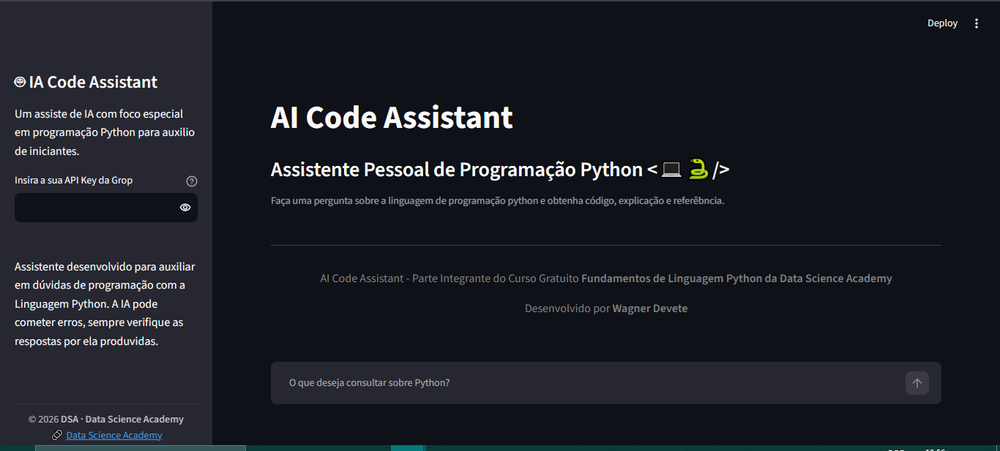
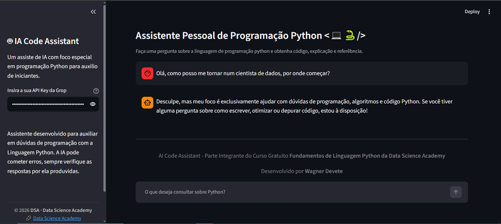
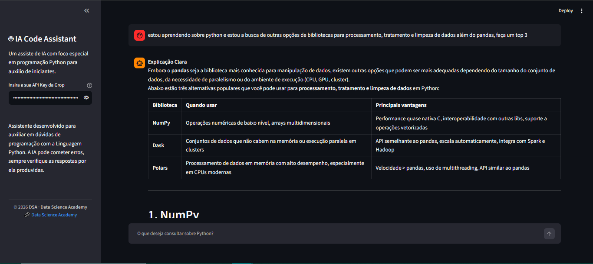

# 🤖 AI Code Assistant

Assistente de IA especialista em programação Python, com foco em ajudar desenvolvedores **iniciantes** a tirar dúvidas de forma clara, didática e com exemplos de código comentados.

O assistente responde sempre no formato:
1. **Explicação Clara** do conceito perguntado
2. **Exemplo de Código** em Python, comentado
3. **Detalhes do Código** explicando a lógica linha a linha
4. **📚 Documentação de Referência** com link oficial

---

## 🎓 Contexto

Este projeto foi desenvolvido como parte do curso gratuito **[Fundamentos de Linguagem Python - Do Básico a Aplicações de IA](https://www.datascienceacademy.com.br/path-player?courseid=fundamentos-de-linguagem-python-do-basico-a-aplicacoes-de-ia)**, da **Data Science Academy (DSA)**.

Foi o meu primeiro contato prático com integração de uma API de IA generativa em uma aplicação — um marco no início da minha jornada rumo à Ciência de Dados. 🚀

---

## 🛠️ Tecnologias utilizadas

- [Python](https://www.python.org/)
- [Streamlit](https://streamlit.io/) — interface web do chat
- [Groq API](https://console.groq.com/) — inferência do modelo `openai/gpt-oss-20b`

---

## ▶️ Como executar localmente

1. Clone o repositório:
   ```bash
   git clone https://github.com/<seu-usuario>/<nome-do-repo>.git
   cd <nome-do-repo>
   ```

2. Crie um ambiente virtual (opcional, mas recomendado):
   ```bash
   python -m venv venv
   source venv/bin/activate  # Linux/Mac
   venv\Scripts\activate     # Windows
   ```

3. Instale as dependências:
   ```bash
   pip install -r requirements.txt
   ```

4. Obtenha uma API Key gratuita da Groq em [console.groq.com/keys](https://console.groq.com/keys)

5. Rode a aplicação:
   ```bash
   streamlit run assistente.py
   ```

6. Insira sua API Key da Groq na barra lateral e comece a conversar! 💬

---

## 📸 Demonstração

*(inserir print ou GIF da aplicação em uso aqui)*
**Tela inicial**


**Filtro de escopo — o assistente recusa perguntas fora de programação**


**Exemplo de resposta estruturada com comparação de bibliotecas**


---

## 📌 Observações

- A chave de API **não é armazenada** em nenhum momento — ela é inserida pelo usuário na sessão e usada apenas em tempo de execução.
- A IA pode cometer erros; sempre verifique as respostas geradas.

---

## 👤 Autor

Desenvolvido por **Wagner Devete**

[LinkedIn](www.linkedin.com/in/wagnerdevete) · [GitHub](https://github.com/wdevette)
